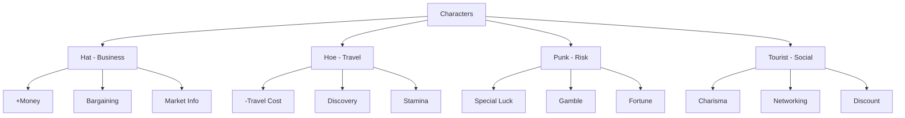

# Pizza Wars - Character Skills & Attributes Plan

## Game Context
- **Type:** Trading/Entrepreneurial simulation game
- **Mechanics:** Travel between global locations, buy/sell food products, upgrade planes, grade progression (1-33), friend NPC system, lodge minigame
- **Current Characters:** Hat, Hoe, Punk, Tourist (purely cosmetic)

## Proposed Character Skill System

Each character will have a **signature skill** and **attribute bonuses** that create unique gameplay strategies.

---

## Character Skill Proposals

### 1. Hat - The Business Mogul
*Theme: Trading expertise and financial acumen*

| Attribute | Value | Effect |
|-----------|-------|--------|
| **Starting Money** | +200 $ | Starts with 866 $ instead of 666 $ |
| **Bargaining** | +15% | Better buy prices at markets |
| **Market Knowledge** | Active | Sees price trends for next turn |

**Signature Ability: Insider Tip**
- Once per game session, reveal the next turn's special modifier location and product before traveling

**Lore:** A seasoned entrepreneur who knows the ins and outs of the pizza market. Always looking for the next big deal.

---

### 2. Hoe - The Globe Trotter
*Theme: Travel efficiency and exploration*

| Attribute | Value | Effect |
|-----------|-------|--------|
| **Travel Cost** | -20% | Cheaper flights between locations |
| **Discovery** | +1 | Extra product available at each location |
| **Stamina** | +1 | Can make 2 trips per turn (instead of 1) |

**Signature Ability: Scout Ahead**
- After traveling, instantly see which location has the best prices for your inventory (before ending turn)

**Lore:** A restless wanderer who's visited every corner of the world. Knows the best routes and hidden gems.

---

### 3. Punk - The Risk Taker
*Theme: High-risk, high-reward gameplay*

| Attribute | Value | Effect |
|-----------|-------|--------|
| **Special Luck** | +25% | Higher chance of green specials (multipliers) |
| **Gamble Bonus** | +30% | Extra sell price when betting on specials |
| **Fortune** | Passive | 10% chance to find rare items at any location |

**Signature Ability: Double or Nothing**
- Once per turn, double the effect of a special modifier (both positive and negative)

**Lore:** Lives life on the edge. Doesn't play it safe—plays to win big.

---

### 4. Tourist - The People Person
*Theme: Social interactions and NPC relationships*

| Attribute | Value | Effect |
|-----------|-------|--------|
| **Charisma** | +20% | Friend stays at your location longer |
| **Networking** | +1 | Extra friend location known at start |
| **Discount** | 10% | Always get 10% off purchase prices |

**Signature Ability: Popularity**
- Friend's favorite product is always available, regardless of location

**Lore:** Everyone's best friend. Knows how to work a room and get what they want through charm.

---

## Implementation Recommendations

### Phase 1: Data Structure
```
characters = [
  {
    id: 1,
    name: 'Hat',
    image: '/images/characters/hat.jpg',
    attributes: {
      startingMoney: 200,      // bonus
      bargaining: 0.15,        // +15% better buy prices
      marketKnowledge: true,  // sees next turn trends
      travelCost: 1.0,         // normal
      specialLuck: 0,          // none
      charisma: 0,
    },
    signatureAbility: 'insiderTip',
    cooldown: 1  // uses per session
  },
  // ... etc
]
```

### Phase 2: Game Mechanics Integration
1. Modify `INITIAL_MONEY` in GameScreen based on character selection
2. Add price modification in `buyItem()` function based on bargaining
3. Add travel cost calculation based on character travel attribute
4. Implement signature abilities as special game events

### Phase 3: UI Updates
1. Show character attributes in NewGame character selection
2. Add ability indicator in GameHUD
3. Display attribute bonuses in CharacterTab

### Phase 4: Balance Testing
- Ensure no character is overpowered
- Test combinations with friend system
- Verify grade progression remains challenging

---

## Summary Diagram



---

## Next Steps
1. Review this plan and confirm character themes
2. Decide on implementation priority
3. Move to Code mode to implement the skill system
4. Test and balance the attributes


LUCK
BRIBE
PUBBLIC RELATIONS
PRICES
